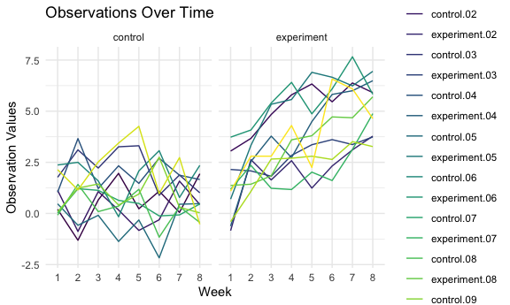

p8105_hw5_yw4199
================
Yaduo Wang
2023-11-13

``` r
library(tidyverse)
```

    ## ── Attaching core tidyverse packages ──────────────────────── tidyverse 2.0.0 ──
    ## ✔ dplyr     1.1.3     ✔ readr     2.1.4
    ## ✔ forcats   1.0.0     ✔ stringr   1.5.0
    ## ✔ ggplot2   3.4.3     ✔ tibble    3.2.1
    ## ✔ lubridate 1.9.2     ✔ tidyr     1.3.0
    ## ✔ purrr     1.0.2     
    ## ── Conflicts ────────────────────────────────────────── tidyverse_conflicts() ──
    ## ✖ dplyr::filter() masks stats::filter()
    ## ✖ dplyr::lag()    masks stats::lag()
    ## ℹ Use the conflicted package (<http://conflicted.r-lib.org/>) to force all conflicts to become errors

``` r
library(broom)

# Setting options. 
knitr::opts_chunk$set(
  fig.width = 6,
  fig.asp = .6,
  out.width = "90%"
)

theme_set(theme_minimal() + theme(legend.position = "bottom"))

options(
  ggplot2.continuous.colour = "viridis",
  ggplot2.continuous.fill = "viridis"
)

scale_colour_discrete = scale_colour_viridis_d
scale_fill_discrete = scale_fill_viridis_d
```

## Problem 2

``` r
#get names of all files
file_name_list = list.files(path = "data", pattern = "*.csv", full.names = TRUE)

#Create a tidy dataframe containing data from all participants, including the subject ID, arm, and observations over time:
file_name_df = data_frame(file_name_list)
```

    ## Warning: `data_frame()` was deprecated in tibble 1.1.0.
    ## ℹ Please use `tibble()` instead.
    ## This warning is displayed once every 8 hours.
    ## Call `lifecycle::last_lifecycle_warnings()` to see where this warning was
    ## generated.

``` r
file_df = 
  file_name_df |> 
  map_dfr(read_csv) |> 
  mutate(subject_id = substring(file_name_list, 10, 11),
           arm = substring(file_name_list, 6, 8)) |> 
  mutate(
    arm = 
      case_match(
        arm, 
        "con" ~ "control", 
        "exp" ~ "experiment")) |> 
  relocate(arm, subject_id) |> 
  pivot_longer(
    week_1:week_8,
    names_to = "week", 
    values_to = "value") |> 
  mutate(week = substring(week, 6,6))
```

    ## Rows: 20 Columns: 8
    ## ── Column specification ────────────────────────────────────────────────────────
    ## Delimiter: ","
    ## dbl (8): week_1, week_2, week_3, week_4, week_5, week_6, week_7, week_8
    ## 
    ## ℹ Use `spec()` to retrieve the full column specification for this data.
    ## ℹ Specify the column types or set `show_col_types = FALSE` to quiet this message.

``` r
# Make a spaghetti plot showing observations on each subject over time, and comment on differences between groups.
file_df |> 
  group_by(arm, subject_id) |> 
  ggplot(aes(x = week, y = value, 
             group = subject_id, 
             color = interaction(arm, subject_id))) +
  geom_line() +
  facet_grid(~arm) +
  labs(title = "Observations Over Time by Two Arms",
       x = "Week", y = "Observation Values", color = "Arms") +
  theme_minimal()
```



Experimental groups have higher oberservational values overall compared
to the control group over time. Moreover, the experimental group shows
an overall increasing trend, compared to the more constant trend in the
control group over time.

## Problem 3

``` r
set.seed(1)
```

``` r
#Set the design elements. 
n = 30
sigma = 5
alpha = 0.05
true_mu_values = c(0, 1, 2, 3, 4, 5, 6)
datasets_number = 5000
```

``` r
# Create output list.
power = vector("list", length = 0)
estimate_result = vector("list", length = 0)
estimate_rejected_null = vector("list", length = 0)

# T-test
t_test_function = function(true_mu) {
  data = rnorm(n, mean = true_mu, sd = sigma)
  
  test_result = broom::tidy(t.test(data, mu = 0))
  return(c(pull(test_result,estimate), 
           pull(test_result,p.value)))
  }

# Simulation
for (mu in true_mu_values) {
  results = replicate(datasets_number, t_test_function(mu))
  
  estimates = results[1, ]
  
  p_values = results[2, ]
  
  power[[as.character(mu)]] = mean(p_values < alpha)
  estimate_result[[as.character(mu)]] = mean(estimates)
  estimate_rejected_null[[as.character(mu)]] = mean(estimates[p_values < alpha])
  
  }
```

``` r
for(i in 0:6) {
     
     # display the values
    print(i)
}
```

    ## [1] 0
    ## [1] 1
    ## [1] 2
    ## [1] 3
    ## [1] 4
    ## [1] 5
    ## [1] 6
